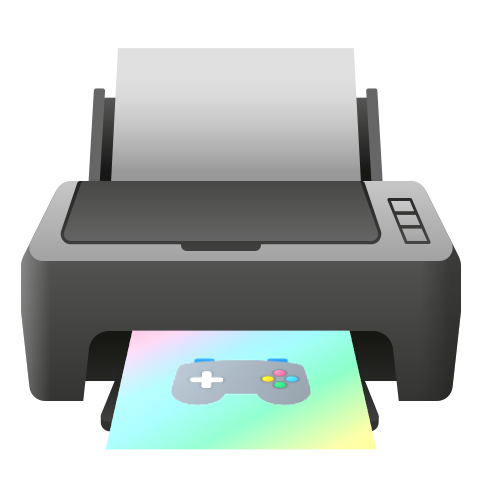

 
# **GamePrinter**

**Simple python script _(by simple I mean over-engineered™)_ that sends game screenshots to the printer...**

_Windows only. (Sorry macOS and Linux users)_

## FAQ
#### How?
The script checks for the latest screenshot in a specified folder and sends it to the printer. It works on my _Epson Ecotank L3110_ printer and I don't know if it works on other printers.

#### Why?
~~Because it's fun.~~
Why not?

## Installation

0. Install [Python](https://python.org/)  on your system

1. Clone the repository.
    ```bash
    git clone https://github.com/LoadingOfficial/GamePrinter/
    ```

2. Navigate into the directory
    ```bash
    cd "GamePrinter-master"
    ```

3. Run the script
    ```bash
    python main.py
    ```

4. [Set the default printer on Windows](https://support.microsoft.com/en-us/windows/how-to-set-a-default-printer-in-windows-10-e10cf8b8-e596-b102-bf84-c41022b5036f#:~:text=To%20choose%20a%20default%20printer,default%20printer%20on%20your%20own.)

5. Edit the newly created `config.json` file with the path to your screenshots folder.
    Change any backslashes (`\`) to forward slashes (`/`) in the path.

    `config.json`
    ```json
    {
    "directory": "C:/path/to/screenshots/folder",
    "refresh_time": 5
    }
    ```
5. Run the script again.
    ```bash
    python main.py
    ```

6. *Enjoy!*

## To Do
- [ ] Add launch arguments support
- [ ] Make a config wizard to make it easier to setup
- [ ] Create a GUI
- [ ] Clean up the code
- [ ] Optimize the way I detect new files

(probably will never happen because I'm lazy)

## License
This project has the _I don't give a fuck what you do with the code as long as you credit me © [patent pending]_ license.

> This repo goes hard, feel free to screenshot!


